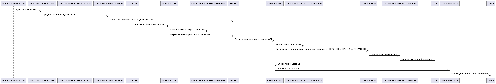

# Blockchain For Logistics & Transportation

## Бизнес функция

Связь существующих логистических бизнес-процессов в рамках единой децентрализованной и прозрачной системы, которая позволяет обеспечить более точное отслеживание товара.

## Ценности и неприемлимые события в их отношении

|№  | Ценность | Неприемлимое событие | Комментарий |
|----|----|----|----|
|2 | Товар | потеря данных о местонахождении товара | денежные издержки |

## Роли пользователей

|№  | Роль | Описание | Комментарий |
|----|----|----|----|
|1 | User | Делает заказ | Общее понятие, может поразумевать как одного человека, так и eCommerce систему |
|2 | Courier | Доставляет заказ | Общее понятие, может поразумевать как одного человека, так и транспортную компанию |

## Высокоуровневая архитектура до внедрения кибериммунитета

| Название | Назначение | Комментарий |
| --- | --- | --- |
| *GPS data provider* | Предоставление GPS данных  | |
| *GPS data processor*| Обработка GPS данных |  |
| Proxy   | Прокси-сервер | |
| Courier  | Курьер ||
| Mobile App | Мобильное приложение ||
| Delivery status updater | Обновление статуса доставки ||
| Service API | сервис API | |
| Access Control layer API | Ограничивает и контролирует доступ к внутренним функциям приложения для других сервисов ||
| Validator   | Валидатор ||
| Transaction processor   | Обработчик транзакций ||
| DLT | Распределенный реестр | |
| Web service | Веб-сервис ||

## Цели и предположения безопасности

### Цели безопасности

1. Данные о местоположении заказа в контрольных точках в момент обновления статуса должны быть целостными(не противоречить данным GPS).

### Предположения безопасности

1. Не рассматриваются атаки с использованием физического доступа(кража товара во время транспортировки сторонними лицами и др.)
2. Предполагается, что курьеры авторизованы в системе.
3. Transaction processor считается доверенной.

### Негативные сценарии 

1. GPS data provider вышел из строя или подменяет координаты.
В данном случае мы добавляем новую сущность GPS monitoring system, которая повышает целостность данных.

  

2. Курьер забыл сделать обновление статуса в контрольной точке или система Delivery status updater скомпроментрована. 
В данном случае мы довабляем новую сущность Monitoring Update, которая запускает проверку Delivery status updater и инициирует отправку уведомления курьеру.

 

Комментарий: так как Validator не знает откуда пришла ошибка, то две эти системы мониторинга будут запускатся одновременно, но они так же могут проводить независимые проверки с определенным интервалом.

### Политика архитектуры

Комментарий: как дополнение к этой задаче можно декомпозировать Transaction provider, чтобы продолжить уменьшать базу даверенного кода
